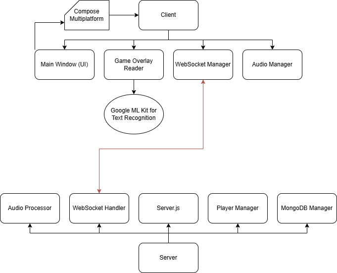

# OrbitComms
OrbitComms is an open-source application designed to enhance the multiplayer experience in Star Citizen. It provides a real-time synchronization system for player positions and group data, integrating with the game to display a 2D map showing the location of players based on their in-game coordinates.

Key features include:

- Real-time player tracking: Synchronize player positions on a dynamic 2D map.
- Group management: Automatically group players and display their members on the map.
- Proximity-based voice chat: Players can communicate via proximity-based radio and group-based voice channels, creating an immersive audio experience.
- Cross-platform support: Built with C# and Avalonia for Windows and Linux compatibility.
- The client communicates with a Node.js backend via WebSockets, ensuring low-latency data exchange. The application also utilizes Tesseract OCR to read in-game coordinates directly from the Star Citizen screen overlay.

OrbitComms is a work in progress and aims to provide an open-source solution for those looking to improve their Star Citizen gameplay experience. Contributions are welcome!

---

# Structure
